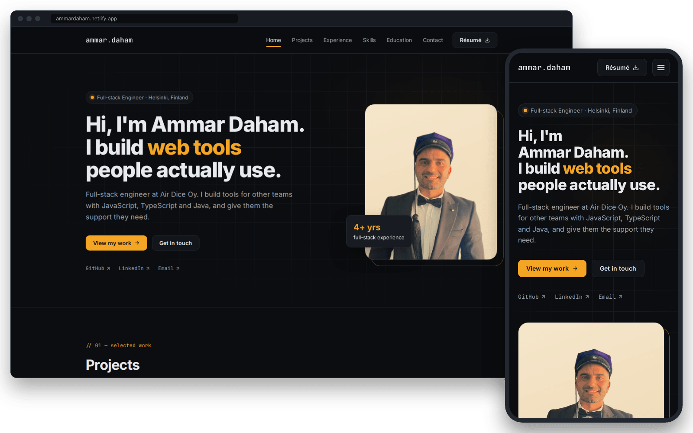

# Ammar Daham — portfolio

[](https://github.com/Ammar-daham/Portfolio-Project/actions/workflows/ci.yml)

My personal site: one page with my projects, work experience, skills and education, a downloadable CV and a contact form. I'm a software engineer in Helsinki, and I build web tools with JavaScript, TypeScript and Java.

**Live site:** https://ammardaham.fi/



## Stack

- **React 18** and **Vite 8**, with no UI framework
- **CSS Modules** on a small set of design tokens (`src/styles/tokens.css`), with self-hosted Inter and JetBrains Mono fonts from Fontsource
- **EmailJS** sends the contact form, so there is no backend to run
- **ESLint 9** (including `jsx-a11y`) and **Prettier**
- Hosted on **Netlify**, with a deploy preview for every pull request

## Run it locally

You need Node.js 22.22.2 or newer. `.nvmrc` pins Node 22, so `nvm install` gets the latest 22.

```bash
nvm install            # or install Node.js 22 another way
npm ci
cp .env.example .env   # then add your EmailJS IDs, see "Contact form"
npm run dev            # http://localhost:5173
```

Without the EmailJS IDs everything works except sending the form. It then shows its error message with a link to email me directly.

| Command                | What it does                                |
| ---------------------- | ------------------------------------------- |
| `npm run dev`          | Start the dev server with hot reload        |
| `npm run build`        | Build the production site into `dist/`      |
| `npm run preview`      | Serve the `dist/` build locally             |
| `npm run lint`         | Run ESLint; any warning fails               |
| `npm test`             | Run the tests once (Vitest)                 |
| `npm run test:watch`   | Re-run the tests as files change            |
| `npm run format`       | Format the code with Prettier               |
| `npm run format:check` | Check the formatting without changing files |

## Where things live

```text
src/
  data/           the content: profile, projects, experience, skills, education,
                  and ui.js for the interface text (labels, headings, messages)
  i18n/           localize() and useContent(): the text in the page's language
  components/     one component per page section (Hero, Projects, Contact…)
  components/ui/  shared building blocks: Section, Button, Card, Tag, Icon
  hooks/          useActiveSection (highlights the current section in the navbar)
                  and useTheme (light and dark theme)
  styles/         design tokens and base styles
  dev/            /ui.html, a dev-only preview of the building blocks
tests/            Vitest tests, one file per section; setup.js loads jest-dom
resume/cv.html    the source of public/Ammar-Daham-CV.pdf
```

**Content:** the profile, projects, jobs, skills and education live in `src/data/`, and the sections render from those files. The interface text (section headings, buttons, form messages) is in `src/data/ui.js`. Text that changes with the language is written as `{ en: '…' }`.

**CV:** to rebuild the PDF, open `resume/cv.html` in Chrome and choose Print → Save as PDF with paper size A4, margins "None" and "Background graphics" on. Save it over `public/Ammar-Daham-CV.pdf`.

## Contact form

The form sends messages through [EmailJS](https://www.emailjs.com/). To set it up:

1. In EmailJS, connect an email service and create a template. The template receives `name`, `email`, `reply_to`, `subject` and `message` (also sent as `description`, for older templates).
2. Put the service ID, template ID and public key in `.env` as `VITE_EMAILJS_SERVICE_ID`, `VITE_EMAILJS_TEMPLATE_ID` and `VITE_EMAILJS_PUBLIC_KEY`. On Netlify, set the same variables under **Site configuration → Environment variables**.
3. In the EmailJS dashboard, limit the allowed origins to the site's domains. These IDs end up in the public JavaScript, so the allowlist is what stops others from using them.

## Checks

Every pull request, and `main` after each merge, runs [GitHub Actions](.github/workflows/ci.yml) on the Node.js version from `.nvmrc`: `npm ci`, lint, the formatting check, the tests and the build. Run the same checks locally before pushing:

```bash
npm run lint && npm run format:check && npm test && npm run build
```

## Deployment

Netlify builds `main` with the settings in `netlify.toml` (`npm run build`, publishing `dist/`) and the Node.js version from `.nvmrc`.
